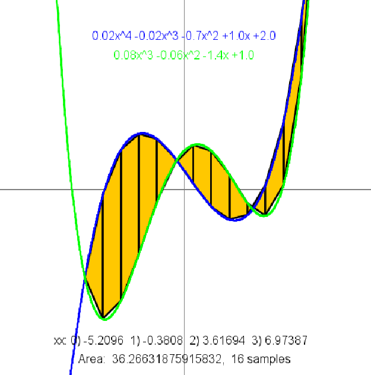

# I2CS_Ex1
# ✨ Ex1 – Polynomial Operations & JUnit Tests
Ariel University – Introduction to Computer Science 2026  

This project implements a complete toolkit for working with polynomial functions represented as double[], along with a full JUnit test suite that validates every function thoroughly.

---

## 📘 What the Project Includes

### Polynomial Functions

- *f(poly, x)*  
  Computes the value of the polynomial at x.

- *root_rec(...)*  
  Recursive bisection method to find a root of a polynomial in a given range.

- *PolynomFromPoints(xx, yy)*  
  Returns a linear or quadratic polynomial passing through 2 or 3 given points.  
  Invalid input → returns null.

- *equals(p1, p2)*  
  Checks whether two polynomials represent the same function (approximate evaluation across sample points).

- *poly(p)*  
  Converts a polynomial array into a human-readable string, e.g.:  
  -1.2x^3 +3.0x^2 +2.0.

- *sameValue(p1, p2, x1, x2, eps)*  
  Finds an x such that p1(x) ≈ p2(x) within tolerance EPS.

- *length(p, x1, x2, n)*  
  Approximates the arc length of f(x) between x1 and x2.

- *area(p1, p2, x1, x2, n)*  
  Approximates the absolute area between two curves.

- *add / sub / mul*  
  Addition, subtraction, and multiplication of polynomials.

- *derivative(p)*  
  Computes the derivative polynomial.

- *normalize(p)*  
  Removes trailing zeros and produces a minimal representation.

- *getPolynomFromString(str)*  
  Parses a string like:  
  "-3x^2 + x - 7"  
  "x"  
  "-x"  
  "4x - 2"  
  etc.,  
  and returns the corresponding coefficient array.

---

## 🧪 JUnit Tests

The project includes an extensive test suite covering *every function*, including:

- Functional tests for:
  - f
  - add
  - sub
  - mul
  - derivative
  - sameValue
  - length
  - area
  - normalize
  - findRootInSegment
  - getPolynomFromString
  - trapezoid / splitTrapezoid

- Edge-case tests:
  - null inputs  
  - zero polynomials  
  - reversed ranges  
  - parsing irregular spacing  
  - polynomials of different degrees  
  - negative segments  
  - high powers  
  - missing x terms  
  - cases where functions produce ZERO  
  - conditions where area must be split by root detection

Each test is short, clear, and directly verifies the expected mathematical behavior.

---

## Example ScreenShot

